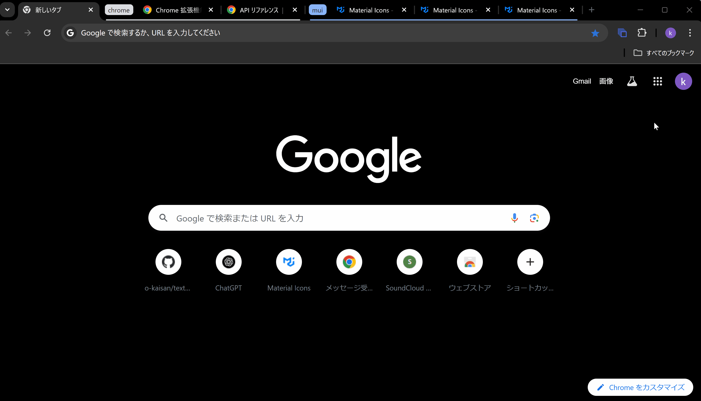

# Tab Group Ex

**Easily manage, group, and save your Chrome tabs.**  
Tab Group Ex helps you organize your tabs into groups with a single click. Group by domain, custom rules, or all at once. You can also save, restore, and manage tab groups effortlessly.

## v3.2.0 Release

Latest updates and improvements in version 3.2.0:

- **[New]** Added a shortcut key to save the current tab group(`Ctrl + Shift + 0`)  
- **[Improved]** Separated the delete icons for tab groups and individual tabs to reduce confusion  
- **[Fixed]** Fixed an issue where clicking the delete button for a tab inside a group would close the extension window  
- **[Removed]** Removed the default shortcut (`Ctrl + Shift + 3`) for the Custom Domain grouping mode  

## Features

- **Group tabs together**  
  Select a grouping mode from the "SETTINGS" page:
  - **All (Default):** Groups all ungrouped tabs into a single group  
    Shortcut: `Ctrl + Shift + 1`
  - **By Domain:** Groups tabs by domain  
    Shortcut: `Ctrl + Shift + 2`
  - **Custom Domain:** Groups tabs by user-defined domains (ignores subdomains)  
    Shortcut: _Not set by default_

- **Ungroup all tabs**  
  Shortcut: _Not set by default_

- **Display a list of groups**  
  - View all tab groups in the current window  
  - Click a group name to show the list of URLs  
  - Right-click a group name to toggle it open or closed  
  - Click the group settings icon to:  
    - Close the group  
    - Ungroup the group

- **Save tab groups**  
  Shortcut: `Ctrl + Shift + 0`

- **Display saved groups**  
  - Click a group name to view its URLs  
  - Restore entire groups or individual URLs

## Custom Domain

To group tabs by custom domains, go to the "Rules" tab and add your domains.

**Example:**  
`https://chrome.google.com/` → `google`  
`https://www.google.com/` → `google`

**Note:**  
- After editing the rules, click **SAVE RULES** to apply changes.  
- Subdomains are ignored and treated as part of the main domain.